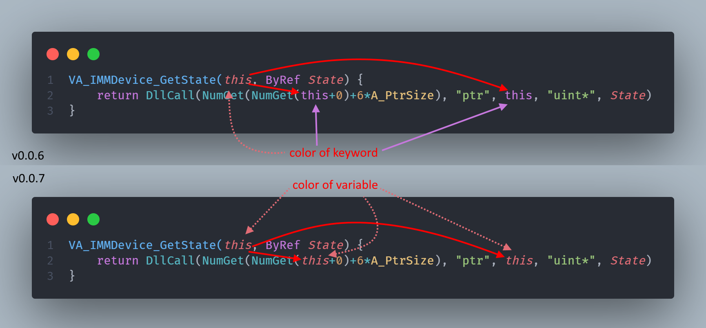

# Changelog

## NEXT 0.0.11(2022-10-15)

- add: // TODO `.msgbox` this variables
- add: // TODO search all `labels:`
- add: // TODO README.md `Privacy Statement`
- add: // TODO test_vsc
- fix: catch user deg regexp errors of `AhkNekoHelp.baseScan.IgnoredList` and `AhkNekoHelp.snippets.blockFilesList`
- fix: not diag first line problem.
- fix: file name like `.AHK` support

## 0.0.10(2022-10-01)

- fix: Completion of class [Completion of class](image/Completion_class.gif)

## 0.0.9(2022-10-01)

- add diag `107` [note](https://github.com/CoffeeChaton/vscode-autohotkey-NekoHelp/tree/master/note#diag107)
- add diag `c505` err of param unknown name style.
- add OutputVar Command set variables exp `FileGetShortcut, LinkFile , OutTarget, OutDir ...`, can semantic-highlight of `Out`.
- fix: hover of msgbox() has document error
- perf: diag of `getCommandErr()` and `getLabelErr()` use hashMap replace regexp.

## 0.0.8(2022-09-25)

- add Completion of Global variables
- add goto Def of class name
- add hover of class name
- add hover of Global variables
- add list all references of ahk-class via `shift+F12`

## 0.0.7(2022-09-19)

### 1. fix semantic-highlight of `value name` === `keyword`



> _theme from [One Dark Pro](https://marketplace.visualstudio.com/items?itemName=zhuangtongfa.Material-theme)
> example code from [VA.ahk](https://github.com/ahkscript/VistaAudio/blob/master/VA.ahk#L465)_

### 2. add Diag `c506` of not support number formats [number](https://www.autohotkey.com/docs/Concepts.htm#numbers)

base10 `99` == base2 `0b1100011` == base8 `0o143` , but ahk v1 just support base10 and base16

> AutoHotkey supports these number formats:
>
> - Decimal integers, such as `123`, `00123` or `-1`.
> - Hexadecimal integers, such as `0x7B`, `0x007B` or `-0x1`.
> - Decimal floating-point numbers, such as `3.14159`.

### 3. Better highlight of Numbers


> _theme from [One Dark Pro](https://marketplace.visualstudio.com/items?itemName=zhuangtongfa.Material-theme)_

[Read More](./README.md#better-highlight-of-numbers)

### 4. fix bug of getRange()

- Fix the error when `Multi-line` and `getRange()` are used together
- now the range of `WM_COMMAND()` is normal.

```ahk
WM_COMMAND(wParam, lParam)
{
    static view := {
    (Join,
        65406: "Lines"
        65407: "Variables"
        65408: "Hotkeys"
        65409: "KeyHistory"
    )}
    ;^ -----------------------------------------here this ...case
    if (wParam = 65410) ; Refresh
        return Refresh()
    if view[wParam]
        return SetView(view[wParam])
} ;<------ range of this line. OK!
```

### 5. break change , remove of `suggest varName of +-5 line`

because of vscode.settings options provided

> Editor › Suggest: Locality Bonus </br>
> Controls whether sorting favors words that appear close to the cursor.

```jsonc
// settings.json
{
    "editor.suggest.localityBonus": true
}
```

## 0.0.6(2022-09-14)

<details>

- add Diag `c302` of `Function name too long, name len > (255 -2) characters.`
- add Diag `c505` of `param parsed Error -> unknown style`
- add Completion of `#Include`
  

- Fix: highlight of number
- Fix: hover of `#Include`
- Fix: until neko-help activate then show `explorer/context`
- Fix: add ahk-doc type color

```js
/**
 * @param {Object} options some msg
 *         ^ Fix: add ahk-doc type color
 */
```

</details>

## 0.0.5(2022-09-05)

- add [note](./note/README.md)
- add diag of [multi-line](https://www.autohotkey.com/docs/Scripts.htm#continuation)
  1. join > 15char
  2. unknown option of multi-line

## 0.0.4(2022-08-27)

- add option of `AhkNekoHelp.snippets.Command`
- add Command of `List #Include Tree`
- fix highlight of `#include exp.ahk`
- fix highlight of [multi-line](https://www.autohotkey.com/docs/Scripts.htm#continuation)
- style: config use markdown

## 0.0.3(2022-08-13)

- add option of `code500 error` flag
- add option of `useSymBolProvider` flag
- add highlight `;@ahk-neko-ignore`
- add highlight `;@ahk-neko-ignore-fn`
- add auto hide `;@ahk-neko-ignore-fn`
- dev: move `displayErr` from `baseDiag` to `TAhkTokenLine`

## 0.0.2(2022-08-08)

1. disambiguation, change `;@ahk-ignore` -> `;@ahk-neko-ignore`

## 0.0.1(2022-08-02)

[release to vscode market](https://marketplace.visualstudio.com/items?itemName=cat1122.vscode-autohotkey-neko-help)

## 0.0.0(2020-04-05)

- fork from [cweijan/vscode-autohotkey](https://github.com/cweijan/vscode-autohotkey)
