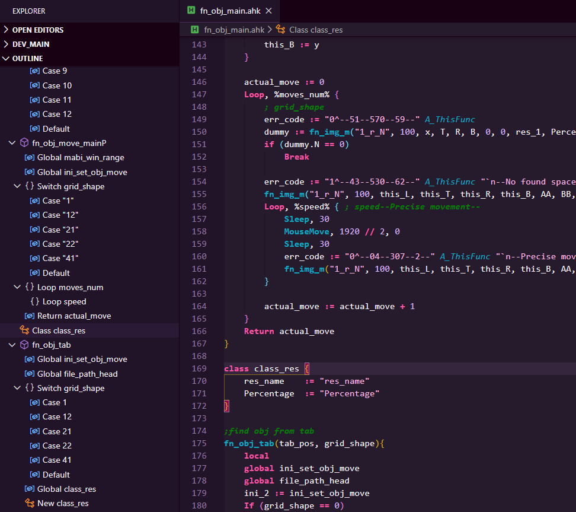
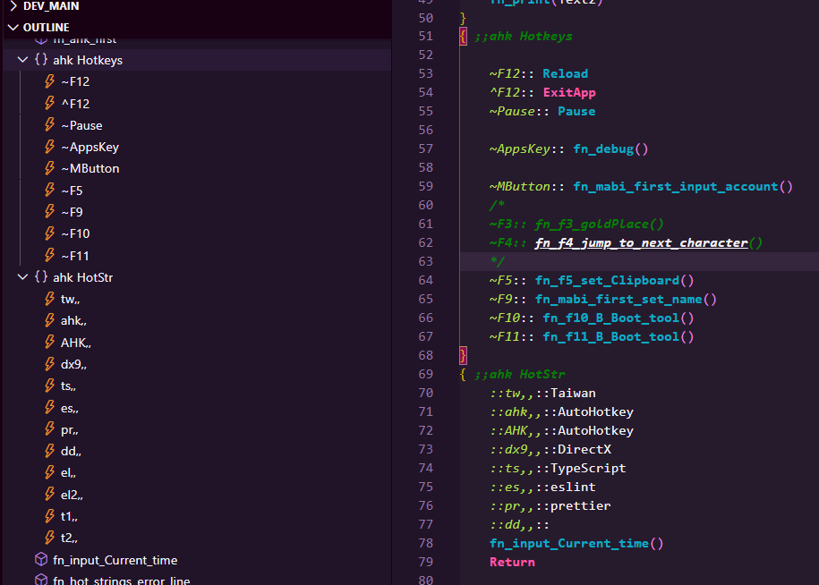

# vscode-autohotkey-Outline

> Base of [ cweijan /vscode-autohotkey ](https://github.com/cweijan/vscode-autohotkey)

my telegram https://t.me/ceenekomimi

AutoHotKey language support for VS Code

* [Code Symbol](#CodeSymbol) and [Method Symbol](#MethodSymbol)
* [Goto Definition](#GotoDefinition)

## MethodSymbol
1. Detech source method as symbol
2. You can add a comment to the method using a semicolon on the previous line of the method

## CodeSymbol

1. You can add two semicolon to comment code block

2. You can see Leveled outline
 - function
 - for
 - class

3. 
 - Static Var
 - Return
 - Switch
 - Case
 - Default
 - GoSub
 - GoTo
 - Label
 - New
 - HotStr
 - HotKeys
 - directive, like '#Include' '#Warn' 
 - Global
 - Throw

## GotoDefinition

1. Press ctrl and move the mouse coordinates to the calling code 

## CodeFormat
1. Right click then click format document.
- **Formatter follows my coding habits, so it may not unsuited for you**.

