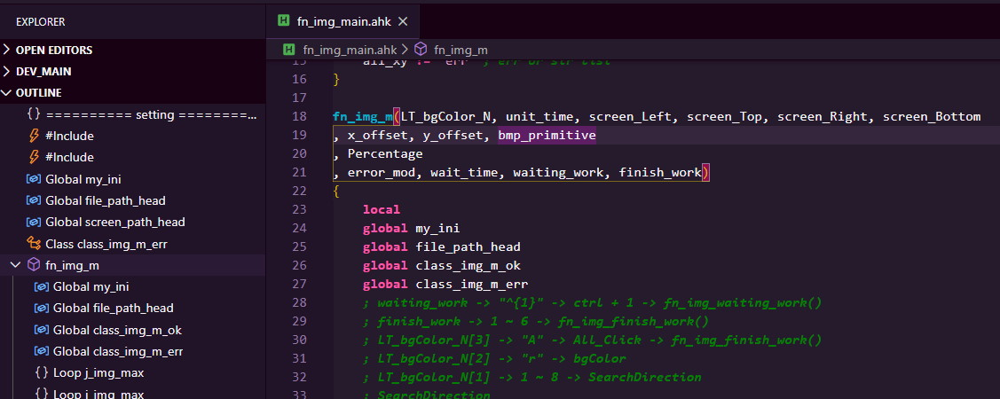

# vscode-autohotkey-Outline

> Base of [cweijan /vscode-autohotkey](https://github.com/cweijan/vscode-autohotkey)

AutoHotKey language support for VS Code

-   [vscode-autohotkey-Outline](#vscode-autohotkey-outline)
    -   [CodeSymbol](#codesymbol)
    -   [GotoDefinition](#gotodefinition)
    -   [Hover](#hover)
    -   [CodeFormat](#codeformat)

## MethodSymbol

1. Detect source method as symbol
2. You can add a `;@ remark` to the method using a semicolon on the previous line of the method.
3. Now you can see "Splitting a Long Line into a Series of Shorter Ones" at Outline.

    

## CodeSymbol

1. You can add two semicolon `;;` to comment line
   or add `{ ;;` to comment code block.

    

2. You can see Leveled outline

-   function
-   for
-   class
-   loop
-   switch

-   Static Var
-   Return
-   Case
-   Default
-   GoSub
-   GoTo
-   Label
-   New
-   HotString, like `::ahk::`
-   HotKeys, like `~F12::`
-   directive, like `#Include` or `#Warn`
-   global
-   Throw
    

## GotoDefinition

1. Press ctrl and move the mouse coordinates to the calling code
2. or at cursor coordinates `F12`
3. List all references
   

## Hover

1. Hover function to show return value or comment

    

    

2. how to add comment of function ?

```
/*
   @ in comment block.
   @ and the line first character is '@'
   @ can use partial grammar of markdown.
   @ exp@email.com
   @ [Markdown Rule](https://en.wikipedia.org/wiki/Markdown)
   @ <https://en.wikipedia.org/wiki/Markdown>
   @ 
   @ ~~strikethrough~~
   @ _italic_ _LLLL111_
   @  `monospace`
*/
```

## CodeFormat

1. Right click then click format document.
2. or `alt` + `shift` + `f`

-   Formatter follows my coding habits, so it may not unsuited for you.
-   my style fork is not formatter Label and Return.
-   **default close now.**
