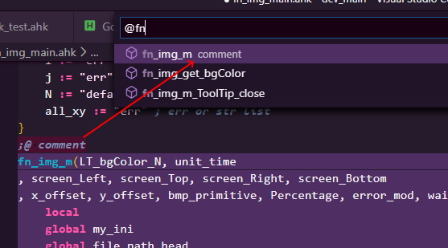
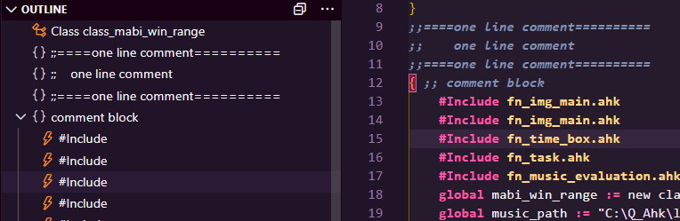

# vscode-autohotkey-Outline

> Base of [ cweijan /vscode-autohotkey ](https://github.com/cweijan/vscode-autohotkey)
> 

> You can see changes in the [changelog](/CHANGELOG.md)

AutoHotKey language support for VS Code
* Code Assistant
* [Code Symbol](#CodeSymbol) and [Method Symbol](#MethodSymbol)
* [Goto Definition](#GotoDefinition)

## MethodSymbol
1. Detech source method as symbol
2. You can add a comment to the method using a semicolon on the previous line of the method

## CodeSymbol

1. You can add two semicolon to comment code block

## GotoDefinition

1. Press ctrl and move the mouse coordinates to the calling code 

## CodeFormat
1. Right click then click format document.
- **Formatter follows my coding habits, so it may not unsuited for you**.

