# vscode-autohotkey-NekoHelp

> Base of [cweijan /vscode-autohotkey](https://github.com/cweijan/vscode-autohotkey)</br>
> Base of regexp match, not the principles of compilation, so parser inaccurate.

AutoHotKey language support for VS Code

- [vscode-autohotkey-NekoHelp](#vscode-autohotkey-nekohelp)
  - [Install](#install)
  - [FunctionSymbol](#functionsymbol)
  - [CodeSymbol](#codesymbol)
  - [GotoDefinition](#gotodefinition)
  - [Find All References support](#find-all-references-support)
    - [Find Ref of Function](#find-ref-of-function)
  - [Function rename](#function-rename)
  - [Hover](#hover)
  - [Diagnostic and lint](#diagnostic-and-lint)
  - [CodeFormat](#codeformat)
  - [IntelliSense](#intellisense)
    - [1. Snippets of your function](#1-snippets-of-your-function)
    - [2. Completion of function variables](#2-completion-of-function-variables)
    - [3. Completion of `#Include`](#3-completion-of-include)
    - [4. Completion of `class`](#4-completion-of-class)
  - [ListAllFunctions](#listallfunctions)
  - [Better highlight of Numbers](#better-highlight-of-numbers)
  - [Privacy Statement](#privacy-statement)
  - [Performance](#performance)
  - [Credits](#credits)
  - [otherSuggest](#othersuggest)

## Install

Install extension via Visual Studio Marketplace [AutoHotkey NekoHelp](https://marketplace.visualstudio.com/items?itemName=cat1122.vscode-autohotkey-neko-help).

## FunctionSymbol

1. Detect source Function as symbol
2. support [continuation](https://www.autohotkey.com/docs/Scripts.htm#continuation) at Outline.
   

## CodeSymbol

1. You can add two semicolon `;;` at line first.
   

2. You can see Leveled outline

- class
- function
- switch, Case, Default
- Labels, like `this_is_a_label:`
- HotString, like `::ahk::`
- HotKeys, like `~F12::`
- directive, like `#Include` or `#Warn`

## GotoDefinition

1. Go to Definition (default via `F12` or `Ctrl+Click`)
2. open the definition to the side with (default via `Ctrl+Alt+Click` )
3. Peek Definition (default via `Alt+F12`)
4. Go to Symbol (default via `Ctrl+T`)
   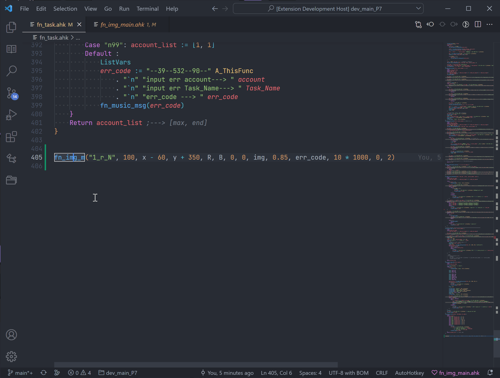
   > ↪ Go to Definition (default via `F12` or `Ctrl+Click`)

## Find All References support

1. Go to References (default via `Shift+F12`)
2. Find All References (default via `Shift+Alt+F12`)

   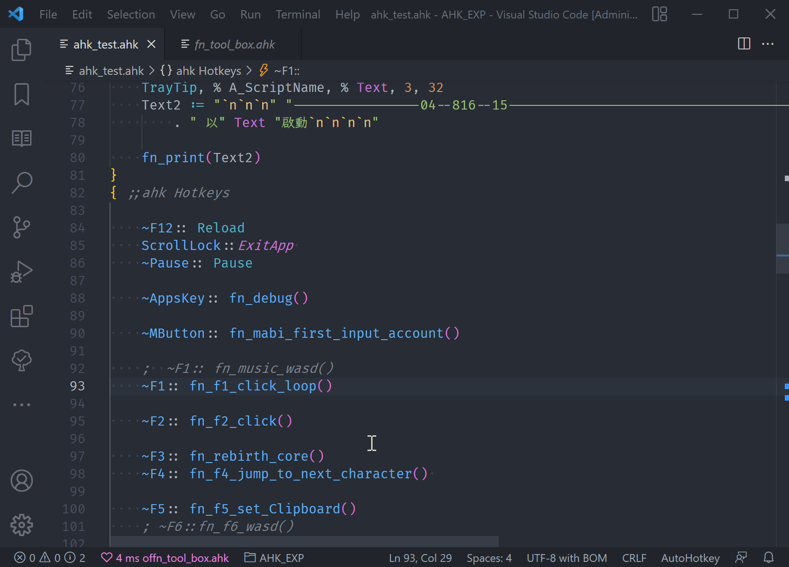
   > 🔍 Find All References (default via `Shift+F12`)

### Find Ref of Function

support to find like

1. `functionName(` , call function.
2. `"functionName"` , wrapped in text.
   >
   > - exp: [func()](https://www.autohotkey.com/docs/commands/Func.htm) or [RegisterCallback](https://www.autohotkey.com/docs/commands/RegisterCallback.htm)
   > - `fnObject := func("functionName")`
   > - `fnObject := RegisterCallback("functionName")`

3. [SetTimer](https://www.autohotkey.com/docs/commands/SetTimer.htm), exp: `SetTimer , Label_or_functionName`
4. [Hotkey](https://www.autohotkey.com/docs/commands/Hotkey.htm), exp: `Hotkey, KeyName , Label_or_functionName`

## Function rename

- auto rename with your can use [[🔍Find All References support]](#find-all-references-support) to find.

## Hover

- Hover to view details on variables, function, command
- Over 200 [Command and Function](https://www.autohotkey.com/docs/commands/) documenting built-in

1. Hover function to show return value or comment

   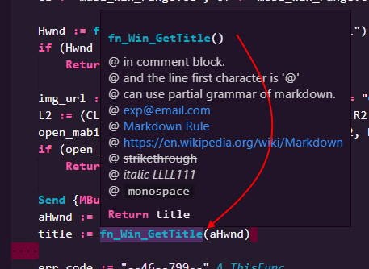

2. Add comment of function ?

```ahk
/**
    * in /** block.
    * and the line first character is '*'
    * can use partial grammar of markdown.
    * exp@email.com
    * [Markdown Rule](https://en.wikipedia.org/wiki/Markdown)
    * <https://en.wikipedia.org/wiki/Markdown>
    * 
    * ~~ABC~~
    * _ABC_ _ABC_
    * - - -
    *  `monospace`
*/
```

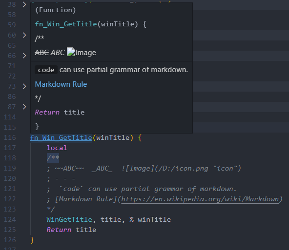

## Diagnostic and lint

⚠️ Diagnostics/Warnings over 30 ruler

1. warning about use `=` not `:=` to assign.
2. warning of Switch
   \
   `default : too much`\
   `Case : not find`
3. use `;@ahk-neko-ignore [number] line.` to ignore,
   \
   exp: `;@ahk-neko-ignore 999 line.`

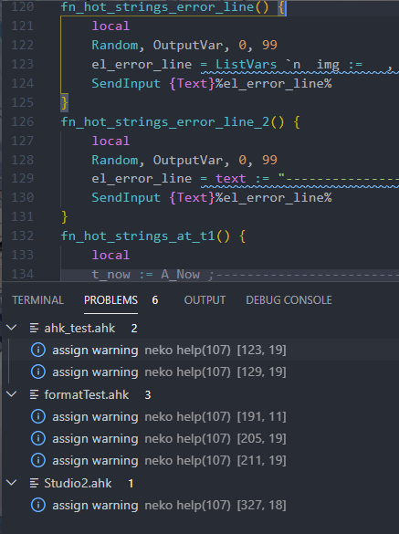
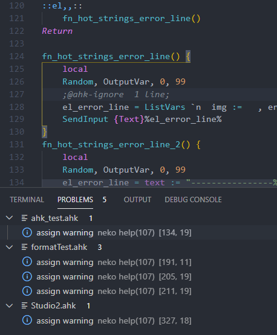

## CodeFormat

1. Right click then click format document.
2. or `alt` + `shift` + `f`
3. add switch case format

// TODO: write more doc

- **beta test now.**

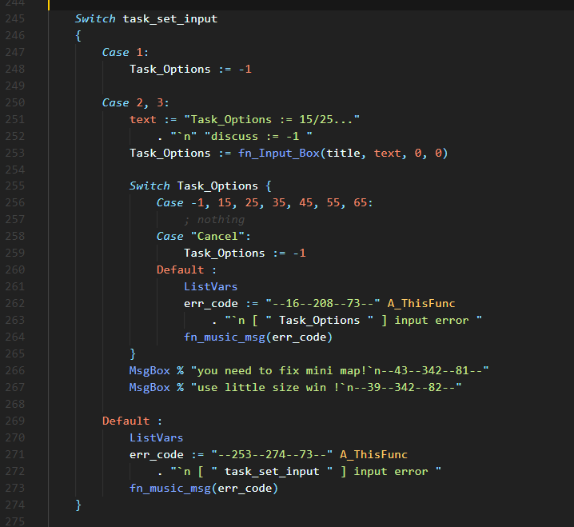

## IntelliSense

### 1. Snippets of your function


### 2. Completion of function variables

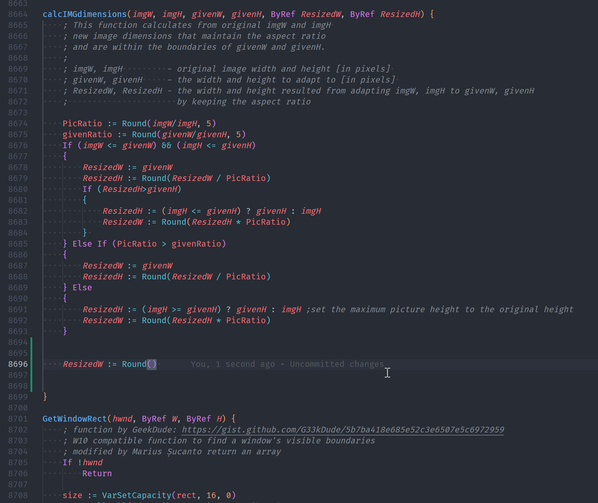

### 3. Completion of `#Include`

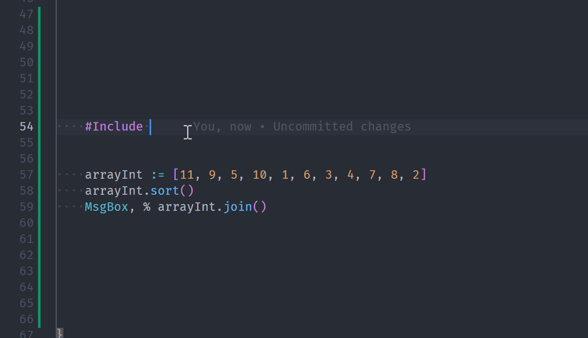

### 4. Completion of `class`

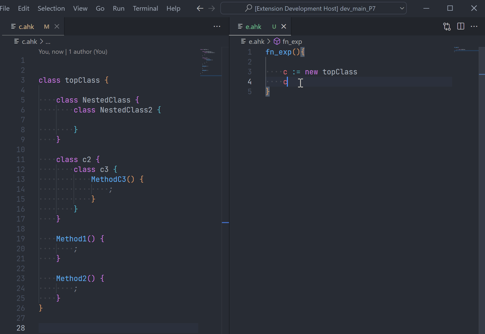

## ListAllFunctions


## Better highlight of Numbers

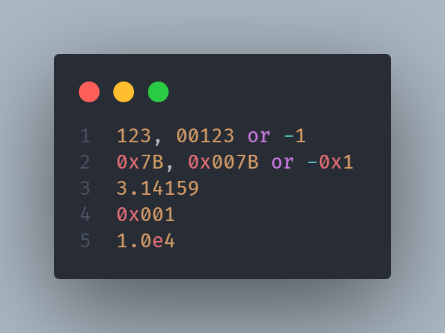

_theme from [One Dark Pro](https://marketplace.visualstudio.com/items?itemName=zhuangtongfa.Material-theme)_

- `0x` and `e` use `keyword.other.unit`
- other number ex `123` `007B` `3.14159` use `constant.numeric`
- exp of your `settings.json` ReadMore of [highlighting](https://code.visualstudio.com/docs/getstarted/themes#_editor-syntax-highlighting)
- [Source code](./syntaxes/ahk.tmLanguage.json)

```jsonc
// settings.json
{
    "editor.tokenColorCustomizations": {
        "textMateRules": [
            {
                "scope": "keyword.other.unit.numeric.hexadecimal.ahk",
                "settings": {
                    "foreground": "#E06C75"
                }
            },
            {
                "scope": "keyword.other.unit.numeric.decimal.ahk",
                "settings": {
                    "foreground": "#E06C75"
                }
            },
            {
                "scope": "constant.numeric.hexadecimal.ahk",
                "settings": {
                    "foreground": "#D19A66"
                }
            },
            {
                "scope": "constant.numeric.decimal.ahk",
                "settings": {
                    "foreground": "#D19A66"
                }
            }
        ]
    }
}
```

## Privacy Statement

- Do not upload any information.
- without vscode, 0 dependencies, Safe and Privacy.
- just scan workspaces or open file. not auto scan like [`A_Desktop`](https://www.autohotkey.com/docs/Variables.htm#Desktop) or [`A_MyDocuments`](https://www.autohotkey.com/docs/Variables.htm#MyDocuments) or any file without workspaces.
- If you need to place .ahk in other folders, this Extensions support [Multi-root Workspaces](https://code.visualstudio.com/docs/editor/multi-root-workspaces).

## Performance

- The best way to improve startup times is to exclude unnecessary files, via [settings.json](https://code.visualstudio.com/docs/getstarted/settings) `AhkNekoHelp.baseScan.IgnoredList`
- When editing becomes slow, split the file, via [`#Include`](https://www.autohotkey.com/docs/commands/_Include.htm)

<!-- - TODO use...try to find each file parsing time. -->

## Credits

- [AutoHotkey Plus by cweijan](https://github.com/cweijan/vscode-autohotkey)
- [AutoHotkey by stef-levesque](https://github.com/stef-levesque/vscode-autohotkey)
- [AutoHotkey_L-Docs](https://github.com/Lexikos/AutoHotkey_L-Docs)
- [AutoHotkey_L](https://github.com/Lexikos/AutoHotkey_L)

## otherSuggest

- [Path Autocomplete](https://marketplace.visualstudio.com/items?itemName=ionutvmi.path-autocomplete)
