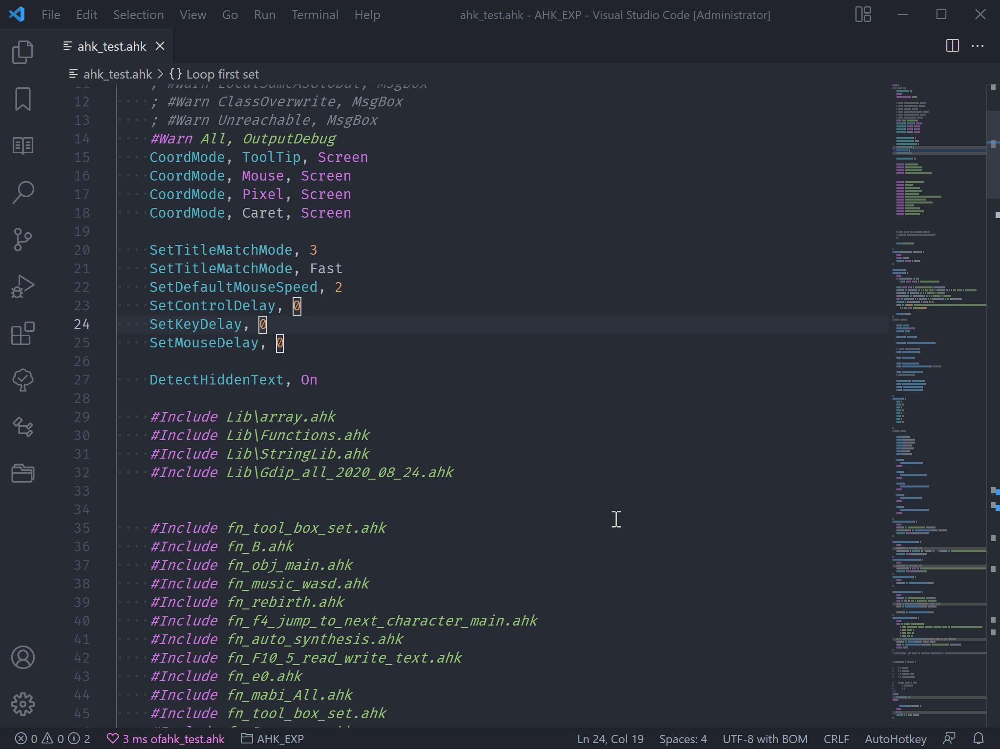

# vscode-autohotkey-NekoHelp

> Base of [cweijan /vscode-autohotkey](https://github.com/cweijan/vscode-autohotkey)
> Base of regexp match, not the principles of compilation, so parser has error.

AutoHotKey language support for VS Code

- [vscode-autohotkey-NekoHelp](#vscode-autohotkey-nekohelp)
  - [Install](#install)
  - [FunctionSymbol](#functionsymbol)
  - [CodeSymbol](#codesymbol)
  - [GotoDefinition](#gotodefinition)
  - [Hover](#hover)
  - [CodeFormat](#codeformat)
  - [Diagnostic and lint](#diagnostic-and-lint)
  - [IntelliSense](#intellisense)
  - [ListAllFunctions](#listallfunctions)
  - [Better highlight of Numbers](#better-highlight-of-numbers)
  - [Credits](#credits)
  - [otherSuggest](#othersuggest)

## Install

Install extension via Visual Studio Marketplace [AutoHotkey NekoHelp](https://marketplace.visualstudio.com/items?itemName=cat1122.vscode-autohotkey-neko-help).

## FunctionSymbol

1. Detect source Function as symbol
2. support [continuation](https://www.autohotkey.com/docs/Scripts.htm#continuation) at Outline.
   

## CodeSymbol

1. You can add two semicolon `;;` at line first.
   

2. You can see Leveled outline

- class
- function
- switch, Case, Default
- Labels, like `this_is_a_label:`
- HotString, like `::ahk::`
- HotKeys, like `~F12::`
- directive, like `#Include` or `#Warn`

## GotoDefinition

1. Go to Definition (via `F12` or `Ctrl+Click`)
2. open the definition to the side with ( via `Ctrl+Alt+Click` )
3. Peek Definition (via `Alt+F12`)
4. Go to References (via `shift+F12`)
   

## Hover

1. Hover function to show return value or comment

   

2. Add comment of function ?

```ahk
/**
    * in /** block.
    * and the line first character is '*'
    * can use partial grammar of markdown.
    * exp@email.com
    * [Markdown Rule](https://en.wikipedia.org/wiki/Markdown)
    * <https://en.wikipedia.org/wiki/Markdown>
    * 
    * ~~ABC~~
    * _ABC_ _ABC_
    * - - -
    *  `monospace`
*/
```


## CodeFormat

1. Right click then click format document.
2. or `alt` + `shift` + `f`
3. add switch case format

- **beta test now.**


## Diagnostic and lint

1. warning about use `=` not `:=` to assign.
2. warning of Switch
   \
   `default : not find`\
   `default : too much`\
   `Case : > 20`\
   `Case : not find`
3. use `;@ahk-neko-ignore [number] line.` to ignore,
   \
   exp: `;@ahk-neko-ignore 3 line.`


## IntelliSense

1. Snippets of your function.
   

2. Completion of function variables
   

3. Completion of `#Include`
   

## ListAllFunctions



## Better highlight of Numbers


_theme from [One Dark Pro](https://marketplace.visualstudio.com/items?itemName=zhuangtongfa.Material-theme)_

- `0x` and `e` use `keyword.other.unit`
- other number ex `123` `007B` `3.14159` use `constant.numeric`
- exp of your `settings.json` ReadMore of [highlighting](https://code.visualstudio.com/docs/getstarted/themes#_editor-syntax-highlighting)
- [Source code](./syntaxes/ahk.tmLanguage.json)

```jsonc
// settings.json
{
    "editor.tokenColorCustomizations": {
        "textMateRules": [
            {
                "scope": "keyword.other.unit.numeric.hexadecimal.ahk",
                "settings": {
                    "foreground": "#E06C75"
                }
            },
            {
                "scope": "keyword.other.unit.numeric.decimal.ahk",
                "settings": {
                    "foreground": "#E06C75"
                }
            },
            {
                "scope": "constant.numeric.hexadecimal.ahk",
                "settings": {
                    "foreground": "#D19A66"
                }
            },
            {
                "scope": "constant.numeric.decimal.ahk",
                "settings": {
                    "foreground": "#D19A66"
                }
            }
        ]
    }
}
```

## Credits

Previous extensions:

- [AutoHotkey Plus by cweijan](https://github.com/cweijan/vscode-autohotkey)
- [AutoHotkey by stef-levesque](https://github.com/stef-levesque/vscode-autohotkey)
- [AutoHotkey_L-Docs](https://github.com/Lexikos/AutoHotkey_L-Docs)

## otherSuggest

- [Path Autocomplete](https://marketplace.visualstudio.com/items?itemName=ionutvmi.path-autocomplete)
