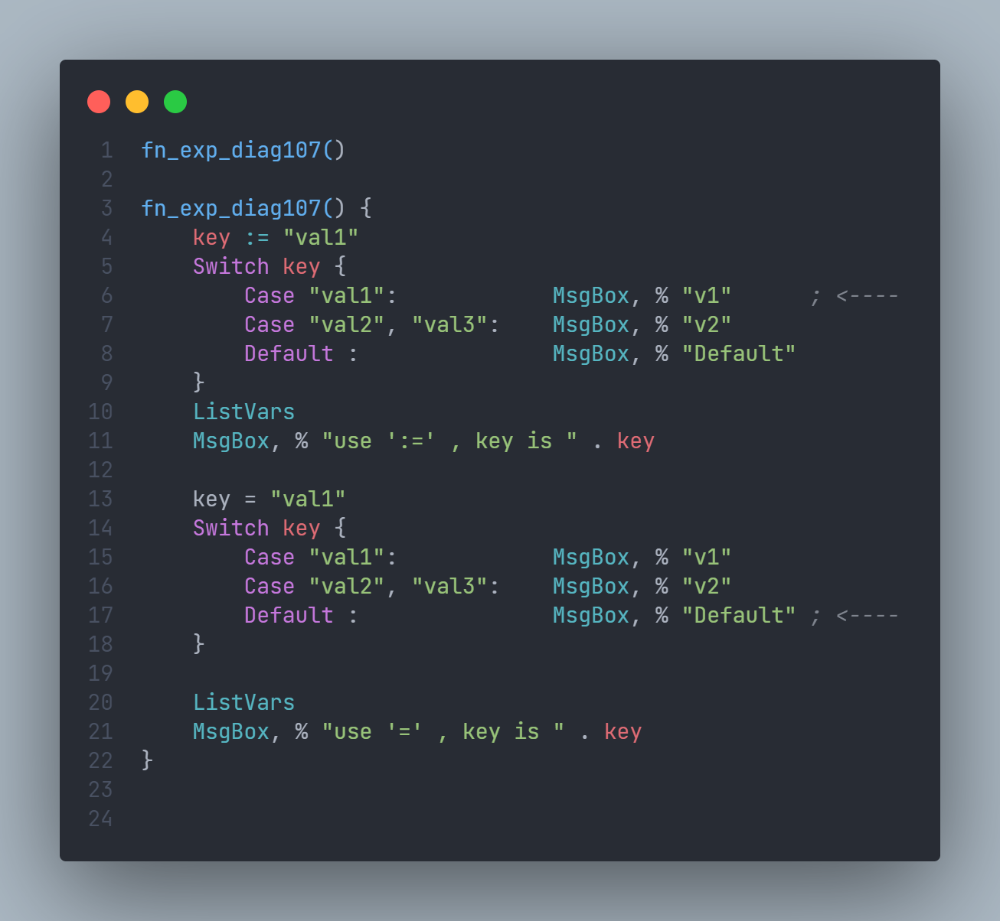

# neko-help-note

> Personal Notes, for reference only

- [neko-help-note](#neko-help-note)
  - [Diagnostic](#diagnostic)
    - [diag107](#diag107)
    - [diag121](#diag121)
    - [diag506](#diag506)
  - [about str or %](#about-str-or-)
  - [DEV note](#dev-note)

## Diagnostic

### diag107

    ```js
    107: {
        msg: 'assign warning',
        path: 'https://www.autohotkey.com/docs/commands/SetEnv.htm',
    },
    ```



> Can you guess the correct result? Without auto diag.

try it [diag107](./ahk/diag107.ahk)

### diag121

    ```js
    121: {
        msg: 'Multi-line:join > 15 characters',
        path: 'https://www.autohotkey.com/docs/Scripts.htm#Join',
    },
    ```

the word `Join` should be followed immediately by as many as `15` characters.


some idea [diag121](./ahk/diag121.ahk)

### diag506

    ```js
    506: {
        msg: 'not support of this number formats',
        path: 'https://www.autohotkey.com/docs/Concepts.htm#numbers',
    },
    ```

Diag `c506` of not support number formats [number](https://www.autohotkey.com/docs/Concepts.htm#numbers)

> base10 `99` === base2 `0o1100011` === base8 `0b143` , but ahk v1 just support base10 base16
>
> AutoHotkey supports these number formats:
>
> - Decimal integers, such as `123`, `00123` or `-1`.
> - Hexadecimal integers, such as `0x7B`, `0x007B` or `-0x1`.
> - Decimal floating-point numbers, such as `3.14159`.

## about str or %

i love `% "str"` style.
<https://www.autohotkey.com/boards/viewtopic.php?f=7&t=48726>

## DEV note

<https://www.autohotkey.com/docs/Language.htm#commands-vs-functions>

> In AutoHotkey v1, it is currently not possible to call a command from an expression, or to call a function using the command syntax.
