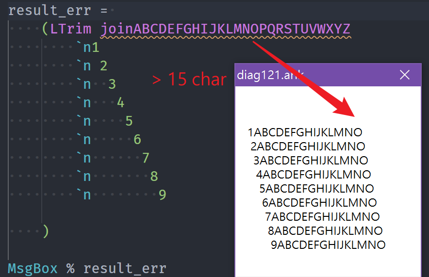

# neko-help-note

> Personal Notes, for reference only

- [neko-help-note](#neko-help-note)
  - [Diagnostic](#diagnostic)
    - [diag121](#diag121)
    - [diag of c506](#diag-of-c506)

## Diagnostic

### diag121

    ```js
    121: {
        msg: 'Multi-line:join > 15 characters',
        path: 'https://www.autohotkey.com/docs/Scripts.htm#Join',
    },
    ```

the word `Join` should be followed immediately by as many as `15` characters.



some idea [diag121](./ahk/diag121.ahk)

### diag of c506

Diag `c506` of not support number formats [number](https://www.autohotkey.com/docs/Concepts.htm#numbers)

> base10 `99` === base2 `0o1100011` === base8 `0b143` , but ahk v1 just support base10 base16
>
> AutoHotkey supports these number formats:
>
> - Decimal integers, such as `123`, `00123` or `-1`.
> - Hexadecimal integers, such as `0x7B`, `0x007B` or `-0x1`.
> - Decimal floating-point numbers, such as `3.14159`.
