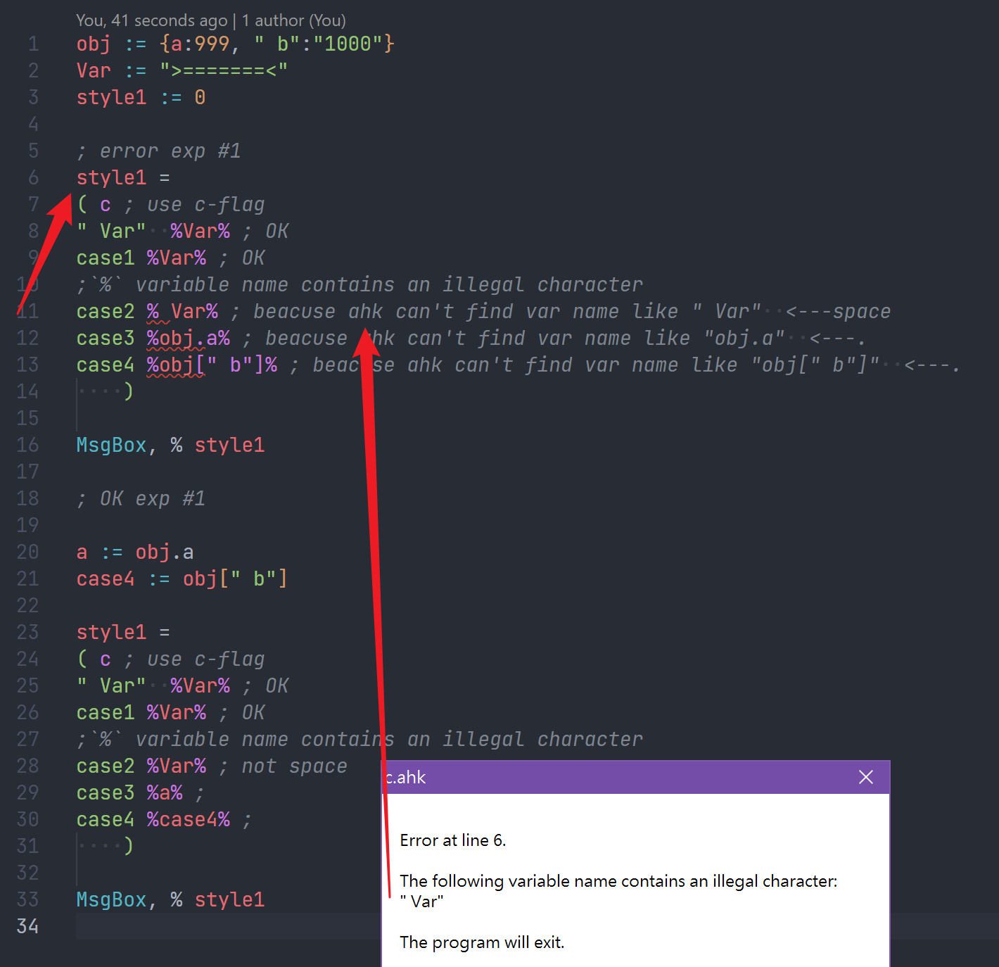

# neko-help-note

> Personal Notes, for reference only

- [neko-help-note](#neko-help-note)
  - [Diagnostic](#diagnostic)
    - [diag107](#diag107)
    - [diag121](#diag121)
    - [diag122](#diag122)
    - [diag124](#diag124)
    - [diag125](#diag125)
    - [diag126](#diag126)
    - [diag302](#diag302)
    - [diag506](#diag506)
  - [about str or %](#about-str-or-)
  - [about ahk class](#about-ahk-class)
  - [DEV note](#dev-note)

## Diagnostic

### diag107

```js
107: {
    msg: 'assign warning',
    path: 'https://www.autohotkey.com/docs/commands/SetEnv.htm',
},
```


> Can you guess the correct result? Without auto diag.

try it [diag107](./ahk/diag107.ahk)

### diag121

```js
121: {
    msg: 'Multi-line:join > 15 characters',
    path: 'https://www.autohotkey.com/docs/Scripts.htm#Join',
},
```

the word `Join` should be followed immediately by as many as `15` characters.[[Read Doc]](https://www.autohotkey.com/docs/Scripts.htm#Join)


some idea [diag121](./ahk/diag121.ahk)

### diag122

```js
122: {
    msg: 'ahk-neko-help not supported "%" "," "`" flag now.',
    path: 'https://www.autohotkey.com/docs/Scripts.htm#continuation-section',
},
```

please use tell me, how to use this flag? [report](https://github.com/CoffeeChaton/vscode-autohotkey-NekoHelp/issues)

### diag124

```js
124: {
    msg: '`"` is not closed',
    path: 'https://github.com/CoffeeChaton/vscode-autohotkey-NekoHelp/tree/master/note#diag124',
},
```


> try it [diag124](./ahk/diag124.ahk)

### diag125

```js
125: {
    msg: '`%` miss to closed',
    path: 'https://github.com/CoffeeChaton/vscode-autohotkey-NekoHelp/tree/master/note#diag125',
},
```


> - [Multiline](https://www.autohotkey.com/docs/Scripts.htm#continuation-section) style1 / exp1 just support `%varName%` style.
> - at this exp `% var%` `%` has a space, this error is at line `9`, but ahk-L report this error at line `5`.
> - try it [diag125](./ahk/diag125.ahk)

### diag126

```js
126: {
    msg: '`%` variable name contains an illegal character',
    path: 'https://github.com/CoffeeChaton/vscode-autohotkey-NekoHelp/tree/master/note#diag126',
},
```



> - [Multiline](https://www.autohotkey.com/docs/Scripts.htm#continuation-section) style1 / exp1 just support `%varName%` style.
> - try to write like line `11` `12` `13`, this error is at line `11`, but ahk-L report error at line `6`.

if [Multiline](https://www.autohotkey.com/docs/Scripts.htm#continuation-section) is very big, this diagnostic can help you find errors faster

> try it [diag126](./ahk/diag126.ahk)

### diag302

```js
302: {
    msg: 'Function name too long, name len > (255 -2) characters.',
    path: 'https://github.com/Lexikos/AutoHotkey_L/blob/master/source/script.cpp#L8744',
},
```

### diag506

```js
506: {
    msg: 'not support of this number formats',
    path: 'https://www.autohotkey.com/docs/Concepts.htm#numbers',
},
```

Diag `c506` of not support number formats [number](https://www.autohotkey.com/docs/Concepts.htm#numbers)

> base10 `99` === base2 `0o1100011` === base8 `0b143` , but ahk v1 just support base10 base16
>
> AutoHotkey supports these number formats:
>
> - Decimal integers, such as `123`, `00123` or `-1`.
> - Hexadecimal integers, such as `0x7B`, `0x007B` or `-0x1`.
> - Decimal floating-point numbers, such as `3.14159`.

## about str or %

i love `% "str"` style.
<https://www.autohotkey.com/boards/viewtopic.php?f=7&t=48726>

## about ahk class


> try it [class_Provider](./ahk/class_Provider.ahk)

- `go to def` `find all ref` just support `topClass`, only [IntelliSense](https://github.com/CoffeeChaton/vscode-autohotkey-NekoHelp#4-completion-of-class) support `NestedClass` of `Method()` now.
- move to line `26` `30` `35` `44` try to `go to def`.
- move to line `1` `12` try to `find all ref`.
- if you need to use [IntelliSense](https://github.com/CoffeeChaton/vscode-autohotkey-NekoHelp#4-completion-of-class) of `a2` now, you need to write `a2 := new XXX` at new line, variable tracking not supported `? :` now.

```ahk
if (OutputVar > 0.5){
  a2 := new C1
} else {
  a2 := new C2
}
```

## DEV note

<https://www.autohotkey.com/docs/Language.htm#commands-vs-functions>

> In AutoHotkey v1, it is currently not possible to call a command from an expression, or to call a function using the command syntax.
